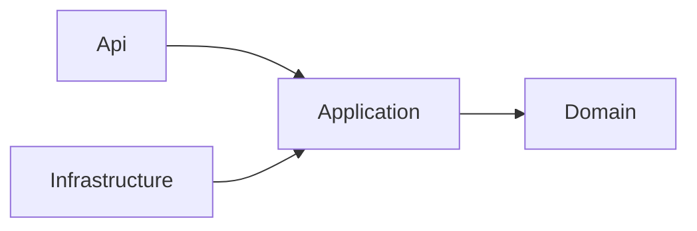
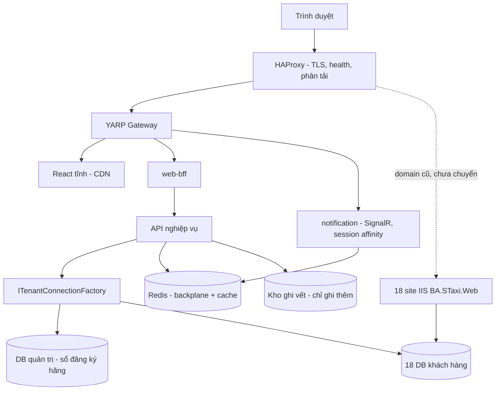
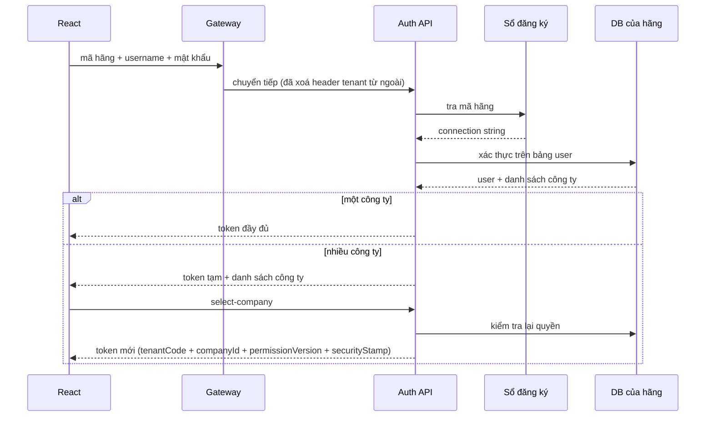

# Architecture Spine — WEB2, nền tảng admin multi-tenant BA STaxi

## Design Paradigm

**Hai mô hình, hai cấp.**

**Cấp hệ thống — Strangler Fig.** WEB2 là một trang web riêng, mọc bên cạnh `BA.STaxi.Web` trên một domain mới, **chỉ dùng chung database**. Không chung phiên, không chung cookie, không cầu SSO. Từng màn hình chuyển sang khi sẵn sàng; web cũ không bị đụng tới và tiếp tục chạy cho tới khi rỗng.

**Cấp dịch vụ — Clean Architecture 4 lớp.**

| Lớp | Namespace | Chứa |
|---|---|---|
| Domain | `Staxi.{Service}.Domain` | Thực thể, kiểu giá trị, `ITenantOwned`, bất biến thuần |
| Application | `Staxi.{Service}.Application` | Use case, abstraction, sổ đăng ký quyền, DTO |
| Infrastructure | `Staxi.{Service}.Infrastructure` | Dapper, Redis, SignalR, secret, adapter ngoài |
| Api | `Staxi.{Service}.Api` | Endpoint, filter, ánh xạ ProblemDetails |

Phụ thuộc chỉ đi **vào trong**. `Domain` không tham chiếu gì.



> **Giới hạn đã biết của paradigm:** tầng Domain **không** ép được bất biến khi `BA.STaxi.Web` ghi song song vào cùng database. Bất biến sống còn phải nằm trong DB bằng constraint. Xem AD-11.

---

## Từ vựng — đọc trước mọi AD

Ba từ dưới đây bị dùng lẫn lộn sẽ tái tạo đúng lỗ hổng `ChangeCompany` của web cũ.

| Từ | Nghĩa chính xác | Kiểu |
|---|---|---|
| **Hãng** (`tenantCode`) | Một khách hàng = **một database riêng**. Gõ ở màn đăng nhập. | `string` |
| **Công ty** (`companyId`) | Một đơn vị **bên trong** một hãng — cột `CompanyId` sẵn có. | `int` |
| **`TenantScope`** | Cặp bất biến `(tenantCode, companyId)` của request hiện tại. **Đây** là "tenant" trong mọi AD. | kiểu riêng |

---

## Invariants & Rules

### AD-1 — Nền .NET 10 LTS, FE build tĩnh

- **Binds:** tất cả
- **Prevents:** nền tảng mới ra đời đã mang sẵn một cuộc nâng cấp; FE thành một thứ phải deploy như ứng dụng
- **Rule:** Mọi dịch vụ .NET nhắm `net10.0`. FE build ra **file tĩnh** — không dùng framework cần Node chạy phía server. Không dùng .NET 8 cho code mới (hết hỗ trợ 10/11/2026).

### AD-2 — Một deployment, database tách riêng, một đường duy nhất tới dữ liệu

- **Binds:** tất cả
- **Prevents:** trộn dữ liệu 18 khách; và một request lấy nhầm connection của hãng khác
- **Rule:** Một bản triển khai phục vụ mọi hãng; mỗi hãng một database. **`ITenantConnectionFactory` là đường duy nhất lấy connection** — cấm `new SqlConnection(...)` và cấm đọc connection string trực tiếp trong code nghiệp vụ. **Factory KHÔNG nhận tham số tenant**: nó đọc `TenantScope` bất biến của request. Không có `TenantScope` ⇒ **ném lỗi**, không có đường mặc định. `ValidateScopes` bật ở **mọi** môi trường, kể cả production.

### AD-3 — Tenant phân giải **trước** khi xác thực

- **Binds:** xác thực, gateway, FE
- **Prevents:** phải xây identity store trung tâm; trùng username giữa 18 DB; lộ danh sách khách hàng
- **Rule:** Người dùng **gõ mã hãng** ở màn đăng nhập (nhớ trong `localStorage`). Mã hãng → sổ đăng ký → connection string → xác thực trên bảng user của chính DB hãng đó. **Cấm mọi endpoint liệt kê hãng khi chưa xác thực.** Mã hãng sai và mật khẩu sai trả **cùng một thông báo, cùng thời gian phản hồi**; rate limit tính cả mã hãng không tồn tại. **Gateway xoá mọi header `X-Tenant*` / `X-Company*` đến từ ngoài** trước khi chuyển tiếp.

### AD-4 — Phạm vi chỉ đến từ token đã ký

- **Binds:** tất cả
- **Prevents:** leo thang tenant qua tham số client — đúng lỗ hổng `HomeController.ChangeCompany` của web cũ
- **Rule:** Token mang `tenantCode` + `companyId` + `permissionVersion` + `securityStamp`. **Cấm suy ra phạm vi từ bất kỳ dữ liệu nào do client gửi** — query, body, header, form, route, hay tham số hub — **bất kể đặt tên là gì**. Lệnh cấm này theo **khái niệm**, không theo tên biến. Đổi công ty = gọi `select-company`, **kiểm tra lại quyền từ DB**, **cấp token mới**. Ép bằng: model binder chặn toàn cục + bài kiểm cấu trúc quét DTO và chữ ký tham số (AD-15).

### AD-5 — Mỗi bảng có đúng một hạng tenant

- **Binds:** Domain, Infrastructure, mọi thay đổi schema
- **Prevents:** hai đội hiểu "lọc theo tenant" thành hai việc khác nhau — một đội không lọc gì vì "đã chọn đúng database", đội kia lọc `CompanyId`
- **Rule:** Mỗi bảng thuộc đúng **một** hạng, khai báo trong sổ đăng ký hạng tenant:

  | Hạng | Nghĩa | Lọc khi truy vấn |
  |---|---|---|
  | `Global` | Giống nhau ở mọi hãng; **phải có nơi ở vật lý xác định** (xem AD-6) | không lọc |
  | `PerTenant` | Thuộc về hãng, **không** chia theo công ty | database đã là biên — cấm lọc `CompanyId` |
  | `PerCompany` | Thuộc về một công ty trong hãng | **bắt buộc** lọc `CompanyId` |
  | `CrossLink` | Nối giữa các công ty trong cùng hãng | lọc theo **tập** công ty được uỷ quyền |

  Thực thể `PerCompany` implement `ITenantOwned`. Repository tự thêm điều kiện theo hạng. Vượt phạm vi phải gọi tường minh `.AcrossTenants(lyDo)` — có quyền riêng, có ghi vết (AD-18), và grep ra được. **Bảng chưa phân hạng ⇒ build đỏ** (AD-15).

### AD-6 — Cache key mang đủ phạm vi; dữ liệu dùng chung phải có sổ

- **Binds:** Infrastructure, BFF, gateway
- **Prevents:** một key trùng tên làm dữ liệu hãng A hiện ở hãng B; và tệ hơn — danh mục của hãng A được phục vụ cho cả 18 hãng
- **Rule:** `CacheKey` là kiểu không có đường khởi tạo thiếu `TenantScope`. Khuôn: `{tenantCode}:{companyId}:{vùng}:{khoá}`.
  **Không có ngoại lệ "dữ liệu tham chiếu" tuỳ nghi.** Vì mỗi hãng có database riêng, **danh mục là của riêng hãng đó** — tỉnh thành, loại xe, mã lỗi ở hãng A có id khác hãng B. Chỉ dữ liệu nằm trong **sổ `SharedReferenceData`** (danh sách tĩnh, khai báo trong mã nguồn, có người duyệt) mới được dùng key không tenant, và phải nạp từ **nguồn thẩm quyền riêng**, không nạp từ database của một hãng bất kỳ. Bài kiểm cấu trúc đối chiếu theo sổ này.
  Key mang tem `permissionVersion` khi nội dung phụ thuộc quyền.

### AD-7 — SignalR: phân giải phạm vi lại ở **mỗi lần gọi**, từ `Context.Items`

- **Binds:** dịch vụ notification, FE
- **Prevents:** một bản tin broadcast tới nhầm khách — lỗi không để lại log và không ai báo
- **Rule:** Lúc handshake, `TenantScope` lấy **từ token** và ghi vào `Context.Items`. Mỗi lần gọi hub method **phân giải lại từ `Context.Items`** — vì mỗi lần gọi là một DI scope mới. **Tuyệt đối không** lấy phạm vi từ tham số của hub method. Tên group `{tenantCode}:{companyId}:{chủ-đề}`, sinh bởi một hàm duy nhất. **Cấm `Clients.All` / `Clients.Others` / `Clients.AllExcept`** — bọc `IHubContext` sau một lớp chỉ nhận `TenantScope`. Backplane Redis có tiền tố `{môi-trường}:{tenantCode}`. Đổi công ty ⇒ rời group cũ, vào group mới.

### AD-8 — Hợp đồng API: mã trạng thái thật + ProblemDetails + corrId

- **Binds:** mọi API, BFF, FE
- **Prevents:** lặp lại sai lầm lớn nhất của web cũ (HTTP 200 kèm trang lỗi HTML); mỗi dịch vụ một hình dạng lỗi
- **Rule:** REST, **mã trạng thái HTTP đúng nghĩa**. Lỗi trả **RFC 9457 ProblemDetails** mở rộng trường `corrId`. **Mọi** phản hồi mang header `corrId`. **Cấm trả HTTP 200 cho một lỗi.** Hình dạng dây (DTO, enum, ngày, tiền, phân trang) định nghĩa **một lần** trong `Staxi.Contracts`; cấm mỗi dịch vụ tự định nghĩa lại. Ép bằng bài kiểm hợp đồng trong CI (AD-15).

### AD-9 — Đường biên stored procedure ↔ .NET, phân theo **tác dụng phụ**

- **Binds:** Infrastructure, mọi việc chuyển màn hình
- **Prevents:** kéo hàng triệu dòng lên tầng API để gom trong RAM; và — nguy hiểm hơn — một proc vừa gom vừa **ghi** lọt vào vế "giữ trong SQL", ghi không vết và không lọc phạm vi
- **Rule:** Phân loại theo tác dụng phụ **trước**, hình dạng truy vấn sau:
  - Proc **có ghi** (`INSERT`/`UPDATE`/`DELETE`/`MERGE`) ⇒ **phải viết lại trong .NET**, dù nó có `GROUP BY` hay không. Không có ngoại lệ.
  - Proc **chỉ đọc + gom dữ liệu** (`GROUP BY`, temp table, window function) ⇒ **giữ trong SQL**, bọc bằng Dapper, trả DTO.
  - Proc **chỉ đọc, đơn giản** ⇒ viết lại trong .NET.
  - **Dynamic SQL** ⇒ chuyển sang query builder có kiểu, ưu tiên cao.

  Proc viết lại **từng cái** khi màn hình tương ứng chuyển sang. Mọi proc còn giữ phải được đăng ký kèm hạng tenant của dữ liệu nó chạm.

### AD-10 — Schema tương thích ngược, một sổ cái, một công cụ

- **Binds:** mọi thay đổi database
- **Prevents:** WEB2 đổi schema làm hỏng web cũ đang chạy trên chính DB đó; và hai công cụ cùng ghi hai sổ cái trên cùng 18 DB
- **Rule:** Chừng nào một hãng còn dùng cả hai web:

  | | |
  |---|---|
  | **Được** | thêm cột `NULL`-able · bảng mới · index · proc mới |
  | **Cấm** | đổi tên cột · đổi kiểu · xoá cột · **đổi nghĩa giá trị** · sửa proc web cũ đang gọi theo cách đổi hình dạng kết quả |

  DDL sống trong git, chạy bằng **grate**. Thư mục theo đúng tên grate dùng (`up`, `views`, `sprocs`, `functions`, `runAfterCreateDatabase`, `beforemigration`…); `Once`/`AnyTime`/`EveryTime` là **loại script gán cho thư mục**, không phải tên thư mục. `sprocs`/`views`/`functions` đặt loại `AnyTime` để chạy lại khi nội dung đổi.
  **Chỉ một sổ cái.** `[Admin.DbMigrations]` hiện có đang được một hệ khác ghi — phải tìm chủ sở hữu và hợp nhất **trước** khi grate chạy lên bất kỳ DB nào.

### AD-11 — Last-write-wins, và bất biến sống còn nằm trong database

- **Binds:** mọi lệnh ghi
- **Prevents:** *(có ý thức không ngăn ghi đè)* — đây là đánh đổi đã chọn
- **Rule:** Không thêm cơ chế tương tranh; ai ghi sau thắng, giống web cũ hôm nay. Đổi lại:
  1. Mọi lệnh ghi phải để lại vết theo **AD-18**.
  2. **Bất biến nghiệp vụ sống còn phải nằm trong database** (check constraint, unique index, foreign key) — vì tầng Domain không ép được khi một ứng dụng khác ghi song song. Bất biến chỉ tồn tại trong code .NET là bất biến **không có thật** trong giai đoạn song song.

### AD-12 — BFF gom dữ liệu, không chứa nghiệp vụ

- **Binds:** web-bff, API nghiệp vụ, FE
- **Prevents:** nghiệp vụ mọc ở hai nơi; trình duyệt tự gom qua hai chặng mạng
- **Rule:** React chỉ gọi **web-bff** qua gateway. BFF **chỉ** gom, chiếu, định hình dữ liệu cho một màn hình — **cấm** chứa quy tắc nghiệp vụ, **cấm** truy cập database trực tiếp (không tham chiếu `ITenantConnectionFactory`). Một màn hình nên là **một** lời gọi BFF.

### AD-13 — Quan trắc OpenTelemetry, và kho quan trắc là dữ liệu nhạy cảm

- **Binds:** mọi dịch vụ
- **Prevents:** mỗi dịch vụ một cách sinh mã tương quan; và — quan trọng hơn — kho log trở thành nơi duy nhất dữ liệu 18 hãng nằm chung không ai canh
- **Rule:** Trace/metrics/logs theo OpenTelemetry, truyền ngữ cảnh bằng `traceparent` W3C. Trace ghi **cả tenant thực thi lẫn tenant hiệu lực**. Lệnh ghi và đổi phạm vi lưu **100%**, phần còn lại lấy mẫu.
  **Kho quan trắc chứa dữ liệu của cả 18 hãng trong một chỗ** — nên: danh sách trường được phép ghi là **danh sách trắng**, không phải danh sách đen; cấm ghi giá trị tham số truy vấn, thân request, PII, thông tin thẻ; truy cập kho có phân quyền và có vết; thời hạn lưu khai báo tường minh.

### AD-14 — Sổ đăng ký hãng: DB quản trị riêng, bí mật có vòng đời

- **Binds:** xác thực, `ITenantConnectionFactory`
- **Prevents:** rải connection string trong file config trên từng máy; và một lần lộ sổ đăng ký là lộ cả 18 khách
- **Rule:** Một bảng trong **DB quản trị riêng**, tách khỏi 18 DB khách. Connection string **mã hoá phong bì**, khoá nằm ngoài mã nguồn và ngoài DB đó. Thêm hãng = thêm một dòng.
  Vì nó là **điểm chết đơn lẻ**: bắt buộc cache cục bộ trong tiến trình + health check riêng + chạy tiếp được khi nó tạm mất.
  Vì cache cục bộ nghĩa là **18 connection string đã giải mã nằm trong RAM mọi tiến trình**: tắt crash dump trên production; ưu tiên phương án **không có mật khẩu** (Managed Identity / xác thực tích hợp) nếu hạ tầng cho phép; khoá phải xoay được; phải có **công tắc vô hiệu một hãng** cắt cả phiên đang chạy, không chỉ chặn đăng nhập mới.

### AD-15 — Mỗi điều cấm phải có một cơ chế ép

- **Binds:** tất cả
- **Prevents:** mọi AD ở trên thoái hoá thành lời khuyên
- **Rule:** Một điều cấm không có dòng trong bảng này thì **không được viết vào spine**. CI làm đỏ build khi bất kỳ cơ chế nào dưới đây kêu.

  | Điều cấm | AD | Cơ chế ép |
  |---|---|---|
  | Suy phạm vi từ dữ liệu client gửi | AD-4 | Model binder chặn toàn cục + quét DTO/chữ ký tham số + gateway xoá header |
  | `new SqlConnection` ngoài factory | AD-2 | Quét assembly |
  | Factory gọi khi không có `TenantScope` | AD-2 | Ném lỗi lúc chạy + `ValidateScopes` mọi môi trường |
  | Bảng chưa phân hạng tenant | AD-5 | Test quét mô hình đối chiếu sổ đăng ký hạng |
  | `CacheKey` dựng thiếu phạm vi | AD-6 | Kiểu không có constructor thiếu `TenantScope` |
  | Key cache dùng chung ngoài sổ | AD-6 | Test đối chiếu sổ `SharedReferenceData` |
  | `Clients.All` / `Others` / `AllExcept` | AD-7 | Quét assembly + `IHubContext` bọc sau lớp chỉ nhận `TenantScope` |
  | Phạm vi lấy từ tham số hub method | AD-7 | Quét chữ ký hub |
  | HTTP 200 kèm lỗi | AD-8 | Test hợp đồng API trong CI |
  | DTO/enum/ngày định nghĩa ngoài `Staxi.Contracts` | AD-8 | Test hợp đồng |
  | Proc có ghi mà vẫn giữ trong SQL | AD-9 | Sổ đăng ký proc + test đối chiếu `sys.sql_modules` |
  | DDL vi phạm luật tương thích ngược | AD-10 | Kiểm tra script trong CI trước khi grate chạy |
  | Lệnh ghi không để lại vết | AD-11 / AD-18 | Trigger DB, không phải code ứng dụng |
  | Trạng thái static thay đổi được | — | Quét assembly (ngoại lệ phải khai báo kèm lý do) |
  | `HttpContext` ngoài một adapter | — | Quét assembly |
  | Singleton giữ dịch vụ scoped | AD-2 | `ValidateScopes` + `ValidateOnBuild` |
  | Rò `TenantScope` sang công việc chạy nền | AD-2 | Công việc nền phải tạo scope mới tường minh; quét assembly |

### AD-16 — Thời gian: UTC trên dây, giờ địa phương trong cột kế thừa

- **Binds:** mọi API, mọi truy cập dữ liệu, FE
- **Prevents:** WEB2 ghi UTC vào đúng cột web cũ đọc là giờ địa phương ⇒ **lệch 7 giờ trên database dùng chung, ngay ngày đầu chạy song song**
- **Rule:** `BA.STaxi.Web` dùng giờ địa phương GMT+7 gần như tuyệt đối (**1.286 `DateTime.Now`** so với **8 `UtcNow`**), và AD-10 cấm đổi nghĩa giá trị cột. Do đó:
  - **Cột kế thừa:** đọc và ghi **giờ địa phương GMT+7**, đúng như web cũ. Không quy đổi.
  - **Cột mới** do WEB2 tạo: dùng `datetimeoffset` hoặc UTC, và **bắt buộc có hậu tố `Utc` trong tên cột**.
  - **Trên dây (API, JSON):** luôn ISO-8601 có offset tường minh. Cấm gửi chuỗi ngày không offset.
  - **Trong code:** cấm `DateTime.Now`/`UtcNow` trực tiếp — dùng `IClock` tiêm vào, để test được và để chỗ quy đổi nằm một nơi.

### AD-17 — Mô hình quyền: sổ đăng ký bằng code, phiên bản hoá

- **Binds:** mọi API, FE, xác thực
- **Prevents:** tái tạo enum `UrlNumberCode` 5.212 dòng; hai tính năng khai báo cùng một quyền theo hai cách; và thu hồi quyền không có hiệu lực
- **Rule:** Quyền là **dữ liệu**, định nghĩa trong một **sổ đăng ký bằng code** (một hằng cho mỗi quyền, khuôn `{TàiNguyên}.{HànhĐộng}`), đồng bộ xuống bảng lúc khởi động. Endpoint khai báo bằng thuộc tính `[HasPermission(...)]`; **UI ẩn/hiện nút đọc cùng một khai báo đó**, không có danh sách thứ hai.
  `PermissionSet` dựng **một lần mỗi request**, tra cứu O(1), mang `permissionVersion`.
  **Vấn đề xuyên hai hệ:** `BA.STaxi.Web` không biết `permissionVersion`. Sửa quyền ở web cũ mà không bump phiên bản thì **token WEB2 vẫn giữ quyền cũ**. Bắt buộc: bump `permissionVersion` bằng **trigger trên bảng quyền/role**, không bằng code ứng dụng — vì chỉ trigger mới thấy được cả hai hệ.
  Ánh xạ từ mã quyền cũ (`UrlNumberCode`, `PermissionTree.cs`) sang sổ mới phải tồn tại và có test, chừng nào hai web còn chạy.

### AD-18 — Sổ ghi vết: đo tại kết nối, chỉ ghi thêm, phủ cả đọc

- **Binds:** mọi truy cập dữ liệu
- **Prevents:** ghi vết lấy tenant từ **cùng nguồn có thể đang sai** ⇒ không phát hiện được chính lớp lỗi nó tồn tại để bù
- **Rule:**
  - Vết đo **tại kết nối vật lý** (`DB_NAME()`, `ORIGINAL_LOGIN()`), **không** lấy từ `TenantScope` của ứng dụng. Nếu hai giá trị lệch nhau ⇒ **cảnh báo**, đó chính là tín hiệu rò rỉ.
  - Lệnh ghi bắt vết bằng **trigger database**, không bằng code ứng dụng — vì `BA.STaxi.Web` ghi song song và sổ vết sẵn có của nó (`BA.STaxi.Web/AuditTrail/`) **không có `corrId`** và **tắt được bằng `Global.AuditActive`**.
  - Vết lưu **giá trị trước và sau**, nếu không thì không dựng lại được vụ ghi đè mà AD-11 chấp nhận.
  - **Phủ cả lệnh đọc** ở những chỗ hậu quả nặng nhất: mọi lần `.AcrossTenants(...)`, mọi kết xuất lớn, mọi báo cáo vượt ngưỡng số dòng. Rò rỉ dữ liệu là chuyện của lệnh **đọc**.
  - Kho vết **chỉ ghi thêm**, tách khỏi database nghiệp vụ, thời hạn lưu khai báo tường minh.

### AD-19 — Mỗi hãng một login SQL riêng `[CẦN XÁC NHẬN VỚI DBA]`

- **Binds:** hạ tầng database, `ITenantConnectionFactory`
- **Prevents:** một login SQL dùng chung cho 18 DB biến **mọi lỗi code** thành rò rỉ dữ liệu xuyên hãng
- **Rule:** Mỗi hãng có login SQL riêng, **chỉ** quyền trên database của hãng đó. Khi đó một lỗi lập trình cho ra `Permission denied` thay vì dữ liệu của khách khác — biên giới cuối cùng nằm ở tầng database, không phụ thuộc vào code đúng.
  Đây là **chốt chắn rẻ nhất và mạnh nhất** trong toàn bộ spine, nhưng cần DBA cấp 18 login. **Chưa xác nhận khả thi — xem Câu hỏi mở.**

### AD-20 — Một màn hình, một chủ sở hữu, ghi trong sổ

- **Binds:** mọi việc chuyển màn hình
- **Prevents:** Strangler Fig không có bước siết — màn hình "đã chuyển" mà web cũ vẫn dùng được, không ai biết trạng thái thật
- **Rule:** Một **sổ chủ sở hữu màn hình** trong git: mỗi màn hình ghi rõ `web-cũ` / `đang-chuyển` / `WEB2`, kèm hãng nào đã cắt sang. Chuyển trạng thái là một thay đổi có review. Sổ này là nguồn sự thật cho câu hỏi "hãng X đang dùng gì" — và là thứ quyết định khi nào luật tương thích ngược của AD-10 được nới cho một bảng.

### AD-21 — Envelope vận hành

- **Binds:** triển khai, hạ tầng
- **Prevents:** một chiều bị bỏ trắng cho tới lúc sự cố đầu tiên
- **Rule:**
  - **Bốn môi trường:** dev · devtest · staging · production. Dữ liệu production **không** được sao xuống môi trường thấp hơn nếu chưa che dữ liệu cá nhân.
  - **Thứ tự triển khai:** migration chạy **trước** app, và chỉ chứa thay đổi tương thích ngược (AD-10) — nhờ đó app cũ và app mới đều chạy được trên schema mới, và rollback app không cần rollback schema.
  - **Rollback:** rollback là **quay lại bản app trước**, không phải quay lại schema. Migration không có bước lùi; sửa sai bằng một migration tiến tới.
  - **Backup/DR:** DB sổ đăng ký (AD-14) phải có sao lưu và quy trình khôi phục **được diễn tập** — mất nó là 18 hãng không đăng nhập được.
  - Triển khai trên 6 máy sẵn có, IIS qua ASP.NET Core Module, Jenkins. Jenkins agent cần .NET runtime để chạy grate (dotnet tool).

### AD-22 — Khoá và bí mật

- **Binds:** xác thực, sổ đăng ký, triển khai
- **Prevents:** khoá ký JWT và khoá mã hoá connection string không có nơi ở và không xoay được
- **Rule:** Khoá ký JWT và khoá mã hoá connection string lưu ngoài mã nguồn, ngoài git, ngoài database chúng bảo vệ. Cả hai **phải xoay được mà không cần dừng dịch vụ** (chấp nhận nhiều khoá cùng lúc trong thời gian chuyển tiếp). Token có thời hạn ngắn + refresh token thu hồi được; `securityStamp` kiểm lại mỗi request để thu hồi có hiệu lực ngay.

### AD-23 — Tư thế bảo mật phía trình duyệt

- **Binds:** FE, gateway
- **Prevents:** SPA token-based tự tạo lỗ hổng mà phía server không thấy
- **Rule:** Token **không lưu trong `localStorage`** (chỉ mã hãng được lưu ở đó). Refresh token trong cookie `HttpOnly` + `Secure` + `SameSite`. CORS danh sách trắng theo domain WEB2. CSP khai báo tường minh. Bật HSTS. Một màn lỗi hiện `corrId` cho người dùng đọc cho CSKH.

### AD-24 — Bài test rò rỉ hai tenant là test đầu tiên của dự án

- **Binds:** tất cả
- **Prevents:** mọi AD cách ly ở trên đúng trên giấy mà chưa từng được chứng minh
- **Rule:** Trước tính năng đầu tiên, dựng bộ test dùng **hai hãng giả**: gọi HTTP bằng token hãng A xin dữ liệu hãng B; phát tin SignalR ở hãng A và khẳng định hãng B **không nhận được gì**; nạp cache ở hãng A và đọc ở hãng B; truy vấn qua repository không phạm vi. Bộ test này chạy trong CI mọi lần, và **mở rộng mỗi khi thêm một cơ chế cách ly mới**.

---

## Consistency Conventions

| Concern | Convention |
|---|---|
| Namespace & project | `Staxi.{Service}.{Domain\|Application\|Infrastructure\|Api}`; hợp đồng dùng chung ở `Staxi.Contracts`; FE `apps/admin-web` |
| Đặt tên | `I{X}Service` / `I{X}Repository`; trường private `_camelCase`; endpoint `kebab-case`; group SignalR `{tenantCode}:{companyId}:{chủ-đề}`; quyền `{TàiNguyên}.{HànhĐộng}` |
| Định danh | `tenantCode` là `string` (mã hãng, không đoán được theo quy luật); `companyId` là `int`; id bản ghi giữ nguyên kiểu trong DB |
| Ngày & giờ | Xem **AD-16**. Tóm tắt: dây = ISO-8601 có offset; cột kế thừa = GMT+7; cột mới = UTC với hậu tố `Utc`; trong code dùng `IClock` |
| Số & tiền | Số thập phân truyền dạng chuỗi trên dây để không mất chính xác; tiền là `decimal`, không `double` |
| Hình dạng lỗi | RFC 9457 ProblemDetails + `corrId`; mọi phản hồi có header `corrId` |
| Ghi log | OpenTelemetry; **danh sách trắng** trường được ghi (AD-13) |
| Cấu hình | Không bí mật trong mã nguồn hay git; connection string chỉ đến từ sổ đăng ký hãng |
| Xác thực | JWT ngắn hạn + refresh thu hồi được; `securityStamp` + `permissionVersion` kiểm mỗi request; **không dùng server session** |
| Truy cập dữ liệu | Dapper; mọi truy vấn qua repository có phạm vi; connection chỉ từ `ITenantConnectionFactory` |
| Ngôn ngữ | Chuỗi giao diện và bình luận tiếng Việt, theo lệ sẵn có |

---

## Stack

*Backend kiểm chứng trên NuGet ngày 2026-09-17; frontend kiểm chứng trên npm ngày 2026-09-18.*

| Name | Version |
|---|---|
| .NET | 10 (LTS, tới 14/11/2028) |
| Yarp.ReverseProxy | 2.3.0 |
| Dapper | 2.1.86 |
| Microsoft.Data.SqlClient | 7.0.3 |
| StackExchange.Redis | 2.13.17 — *xem ghi chú* |
| Microsoft.AspNetCore.SignalR.StackExchangeRedis | 10.0.12 |
| Serilog.AspNetCore | 10.0.0 |
| grate (dotnet tool) | 2.1.6 |
| React | 19.3.0 |
| Vite | 8.3.0 |
| TypeScript | 5.9.3 — *xem ghi chú* |
| @tanstack/react-query | 5.103.1 |
| react-router-dom | 7.18.4 |
| @microsoft/signalr | 10.0.11 |
| bootstrap | 5.3.8 |
| react-bootstrap | 2.10.10 — *xem ghi chú* |
| bootstrap-icons | 1.13.1 |
| ag-grid-community · ag-grid-enterprise · ag-grid-react | 36.2.0 — *xem ghi chú* |
| echarts | 6.1.0 — *xem ghi chú* |
| echarts-for-react | 3.0.6 |
| SQL Server | giữ bản đang chạy, **phải ở mức vá hiện hành** |

**Ghi chú bắt buộc đọc trước khi cài:**

- **`Encrypt` mặc định là `true` từ `Microsoft.Data.SqlClient` 4.0.** 18 SQL Server đang chạy trên IP nội bộ, gần như chắc chắn không có chuỗi chứng chỉ tin cậy ⇒ **mọi kết nối sẽ fail lúc khởi động**. Phải xử lý tử tế bằng chứng chỉ, chứ không phải bằng `TrustServerCertificate=true` — cái đó vô hiệu hoá chính lớp mã hoá đường truyền.
- **StackExchange.Redis ghim 2.13.17, không phải 3.2.1.** 3.2.1 tuy mới nhất nhưng `SignalR.StackExchangeRedis 10.0.12` khai báo phụ thuộc `StackExchange.Redis 2.7.27`. NuGet sẽ nâng lên 3.x và **build vẫn xanh**, nhưng backplane chưa từng xây trên 3.x — lỗi chỉ hiện lúc chạy.
- **TypeScript ghim 5.9.3, không phải 7.0.2.** `typescript-eslint 8.70.0` khai báo peer `typescript >=4.8.4 <6.1.0` — không bộ lint nào hỗ trợ TS 7.
- `Microsoft.Data.SqlClient 7.0.3` chưa có TFM `net10.0`; asset `net9.0` chạy trên .NET 10. `Yarp.ReverseProxy 2.3.0` có TFM cao nhất `net8.0`; tài liệu Microsoft cho ASP.NET Core 10 xác nhận nó hỗ trợ .NET 8 trở lên.
- **`react-bootstrap 2.10.10` chạy được trên React 19, nhưng có đúng một ràng buộc.** React 19 đã gỡ bỏ `ReactDOM.findDOMNode`; `react-bootstrap` còn `safeFindDOMNode` dùng ở `Overlay`, `OverlayTrigger`, `TransitionWrapper`. Đã đọc mã nguồn gói: `react-transition-group 4.4.5` gọi `findDOMNode` ở bốn chỗ nhưng đều dạng `props.nodeRef ? … : findDOMNode(this)`, và `TransitionWrapper` **có** truyền `nodeRef` nên nhánh đó không chạy; chỗ còn lại chỉ gọi khi đối số là thể hiện **class component**. ⇒ **Cấm truyền class component làm con của** `Modal`, `Fade`, `Collapse`, `Overlay`, `OverlayTrigger`, `Tooltip`, `Popover`, `Dropdown`. Vi phạm là **lỗi lúc chạy**, build vẫn xanh. Xem ADR-005.
- **AG Grid dùng bản Enterprise không nạp khoá, làm tương tự web 1.** Đã kiểm trong `ag-grid-enterprise@36.2.0`: tính năng **không** bị chặn, nhưng console in `License Key Not Found` và phần tử `.ag-watermark` **hiện trên lưới ở mọi môi trường** — tức người dùng cuối của cả 18 hãng đều thấy. Ba gói AG Grid phải **cùng một số bản**. Xem ADR-006.
- **ECharts không tự co giãn.** Phải gắn `ResizeObserver` lên vùng chứa, không chỉ nghe `window.resize` — sidebar thu gọn làm đổi kích thước vùng chứa mà cửa sổ không đổi. Vùng chứa phải có chiều cao tường minh. Nhập theo tree-shaking, đừng nhập cả gói.
- **Chưa ghim, phải ghim trước khi dựng môi trường:** Node.js, Redis server, HAProxy, OpenTelemetry SDK, mức vá tối thiểu của SQL Server.

---

## Structural Seed

### Topo triển khai



### Luồng đăng nhập



### Cây nguồn

```text
web2/
  src/
    Staxi.Contracts/          # DTO, enum, hình dạng dây - một nguồn duy nhất
    Staxi.Platform/           # TenantScope, ConnectionFactory, CacheKey, ProblemDetails, tracing
    Staxi.Auth.{Domain,Application,Infrastructure,Api}
    Staxi.Admin.{Domain,Application,Infrastructure,Api}    # danh mục, CRUD config
    Staxi.Reporting.{Application,Infrastructure,Api}       # Dapper + proc chỉ-đọc giữ lại
    Staxi.Notification.Api                                 # SignalR
    Staxi.Bff.Web
    Staxi.Gateway                                          # YARP
  apps/
    admin-web/                # Vite + React + TS
  db/
    up/ views/ sprocs/ functions/     # tên thư mục theo grate
    tenancy-classes.json              # sổ hạng tenant (AD-5)
    screen-owners.json                # sổ chủ sở hữu màn hình (AD-20)
  tests/
    Staxi.ArchitectureTests/  # bảng ép của AD-15
    Staxi.TenantLeakTests/    # AD-24 - viết trước tính năng đầu tiên
```

### Database

Schema là **kế thừa, không thiết kế mới**: 565 bảng, 10.100 cột, 2.003 stored procedure trên DB đang chạy; **215/565 bảng có cột `CompanyId`** ⇒ **350 bảng chưa rõ hạng tenant**. Chỉ **279/2.003 proc** được mã nguồn hiện tại gọi tới (27.684 dòng, 0 cursor, 158 chỉ đọc / 121 có ghi). Phân hạng 350 bảng đó (AD-5) là điều kiện tiên quyết, không phải việc dọn dẹp.

---

## Câu hỏi mở — phải trả lời trước khi hãng đầu tiên lên production

| # | Câu hỏi | Ai trả lời | Chặn cái gì |
|---|---|---|---|
| Q1 | **DBA có cấp được 18 login SQL riêng không?** | DBA / hạ tầng | AD-19 — chốt chắn mạnh nhất của spine |
| Q2 | 18 DB đang **trôi schema** bao nhiêu? (bước 1 của ADR-003, chưa ai chạy) | đội DB | AD-10, và làm việc hoãn ADR-001 thành canh bạc mù |
| Q3 | Ai sở hữu `[Admin.DbMigrations]` và `[Version.ApiSupported]`? | nội bộ | AD-10 — hai sổ cái trên cùng 18 DB |
| Q4 | 18 SQL Server xử lý `Encrypt=true` thế nào — cấp chứng chỉ hay chấp nhận rủi ro? | hạ tầng | Toàn bộ kết nối dữ liệu |
| Q5 | Mức vá SQL Server tối thiểu; có lỗ hổng leo quyền nào đang mở không? | DBA | AD-2/AD-5/AD-19 đều dựa vào biên giới database |
| Q6 | Kết nối 18 DB × N instance × `Max Pool Size` — đặt bao nhiêu? | đội nền tảng | Ổn định lúc tải cao |
| Q7 | Mã hãng đặt theo quy tắc nào; có tái dùng `XNCode` sẵn có? | nghiệp vụ | AD-3 |
| Q8 | Thời hạn lưu vết và log theo **Nghị định 13/2023/NĐ-CP**? | pháp chế | AD-13, AD-18 |
| Q9 | HAProxy hiện là điểm chết đơn lẻ — có cặp active-passive chưa? | hạ tầng | Bán kính ảnh hưởng tăng gấp 18 |

---

## Deferred

| Hoãn | Vì sao hoãn được | Điều kiện xem lại |
|---|---|---|
| Cơ chế lệch phiên bản DB qua `[Version.ApiSupported]` (ADR-001) | Đợt đầu vài màn hình, chưa phát sinh | Khi hãng thứ hai lên WEB2 ở mức schema khác hãng thứ nhất — **và không muộn hơn** |
| Phân hạng tenant cho 350 bảng chưa rõ | Đợt đầu chỉ chạm một phần nhỏ | Trước mỗi lần thêm một vùng nghiệp vụ mới |
| Tách BE thành nhiều dịch vụ | Chưa có gì để tách; BFF đã đủ chỗ gom | Khi hai vùng nghiệp vụ có nhịp phát hành khác nhau |
| BFF cho mobile | Chưa có client mobile | Khi có ứng dụng mobile dùng nền tảng này |
| Nâng StackExchange.Redis lên 3.x | 2.13.17 khớp backplane và đang chạy được | Khi `SignalR.StackExchangeRedis` khai báo phụ thuộc 3.x |
| Nối log WEB2 với log web cũ | Hai trang web riêng, người dùng không đi qua lại trong một phiên | Nếu về sau có luồng chuyển tiếp giữa hai hệ |
| Kubernetes | Bài toán là multi-tenant, không phải mở rộng quy mô | Khi 6 máy không còn đủ |

---

## Rủi ro đã chấp nhận có ý thức

| Rủi ro | Quyết định | Bù đắp |
|---|---|---|
| Hai ứng dụng cùng ghi ⇒ **mất dữ liệu âm thầm** | Last-write-wins (AD-11) | Trigger DB ghi vết trước/sau (AD-18) — phát hiện sau khi xảy ra |
| Tầng Domain **không ép được bất biến** | Chấp nhận trong giai đoạn song song | Bất biến sống còn đặt trong DB bằng constraint (AD-11) |
| Sổ đăng ký hãng là **điểm chết đơn lẻ** | Đổi lấy việc thêm hãng chỉ là thêm một dòng | Cache cục bộ + health check + backup có diễn tập (AD-14, AD-21) |
| Cache cục bộ ⇒ **18 connection string giải mã trong RAM** | Đánh đổi để sống sót khi sổ đăng ký tạm mất | Tắt crash dump, ưu tiên xác thực không mật khẩu, khoá xoay được (AD-14, AD-22) |
| **`HomeController.ChangeCompany` của web cũ** không thấy kiểm tra quyền | Không phải việc của WEB2 | **Xác minh trên hệ chạy thật và vá ở web cũ ngay — độc lập với WEB2** |
